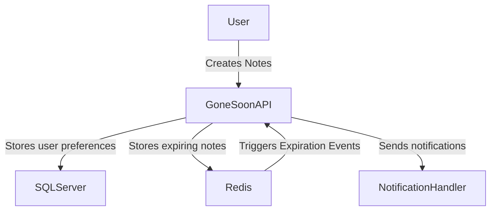
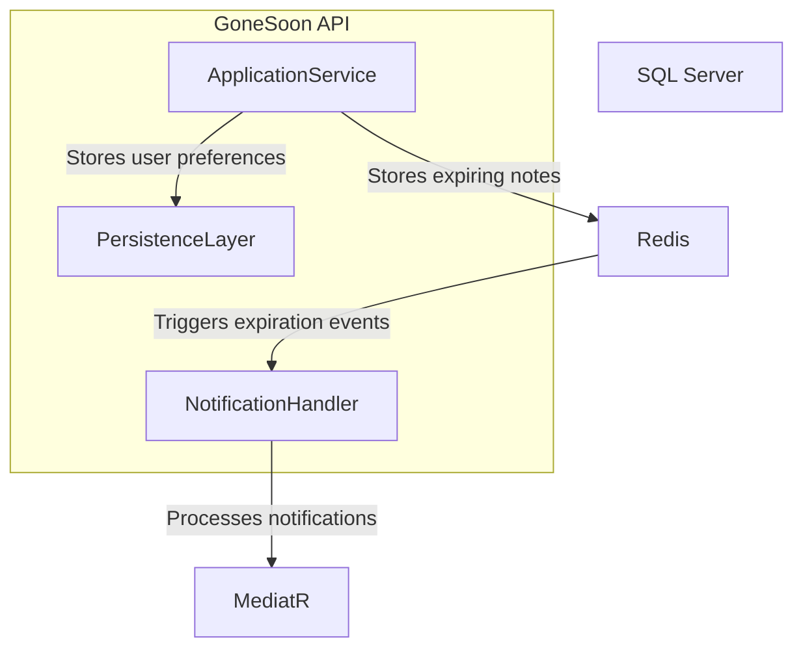
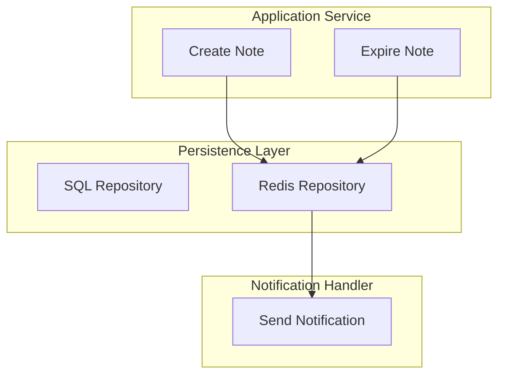

# GoneSoon Architecture

## Overview
GoneSoon is a note-taking application where notes have a limited lifespan. Once expired, they trigger a notification (email, SMS, or push) to remind the user about the task. The project was built as a study of Clean Architecture principles and for fun.

## C4 Model Representation

### 1. Context Level
GoneSoon consists of the following main components:
- **User**: Creates and manages notes.
- **GoneSoon API**: The core application handling note creation, expiration, and notifications.
- **Database (SQL Server)**: Stores user and notification preferences.
- **Redis**: Stores temporary notes with expiration logic.

### 2. Container Level
The system is structured into the following main components:
- **GoneSoon API (ASP.NET Core Web API)**: Manages note operations and triggers notifications.
- **MediatR**: Handles internal communication between services without direct dependencies.
- **SQL Server**: Stores persistent user data.
- **Redis**: Caches temporary notes and handles expiration events.
- **Notification Handler**: Processes and sends notifications when notes expire.

### 3. Component Level
The GoneSoon API consists of several services:
- **Application Service**: Handles note creation and expiration.
- **Notification Handler**: Uses MediatR to process notification events when notes expire.
- **Persistence Layer**: Uses Entity Framework Core for SQL Server and a Redis repository for temporary data.

## Technology Choices
- **.NET 8 (ASP.NET Core Web API)**: Backend framework.
- **Entity Framework Core**: ORM for database operations.
- **Redis**: Temporary storage for expiring notes.
- **MediatR**: Simplifies communication between components.
- **Docker**: Containerized deployment.
- **Swagger**: API documentation.

## Decision Log
### Decision: Use MediatR Instead of RabbitMQ
- **Status**: Accepted
- **Reasoning**: MediatR provides a lightweight in-process messaging solution, reducing infrastructure complexity.

### Decision: Handle Notifications Internally
- **Status**: Accepted
- **Reasoning**: Notifications are handled internally via MediatR instead of a separate microservice, reducing overhead and complexity.

### Decision: No Dedicated Admin Role
- **Status**: Not Implemented
- **Reasoning**: The application does not currently require an admin user for configurations.

## Future Considerations
- Implement a real notification service if external messaging is needed.
- Expand authentication and authorization features.
- Add a frontend UI for better usability.
- Add unit and integration tests.
- Consider user interface for managing notification preferences.

